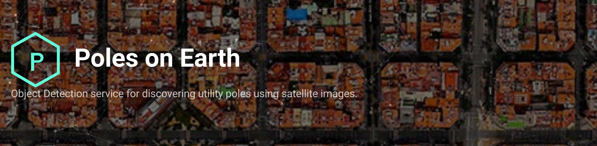

# Poles-on-Earth 

 
&nbsp;

[https://polesonearth.com](https://polesonearth.com)

**Poles on Earth** is an AI web service that provides the positions of utility poles everywhere on Earth using satellite imagery.

See the [documentation](/docs/) for more details.

## License

MIT License

Copyright (c) 2020 T.A. Geoforce P.C.

## Contact

T.A. Geoforce

https://tageoforce.com

Email: info@tageoforce.com
