# Poles on Earth

- [Poles on Earth](#poles-on-earth)
- [Definicions](#definicions)
- [License](#license)
- [1. Introduction](#1-introduction)
- [2. System Architecture](#2-system-architecture)
  - [2.1. Data Architecture](#21-data-architecture)
  - [2.2. Experiments Architecture](#22-experiments-architecture)
- [3. Methodology](#3-methodology)
  - [3.1. Solution Design](#31-solution-design)
- [3.2. Choosing test areas](#32-choosing-test-areas)
  - [3.3. Finding data](#33-finding-data)
  - [3.4. Developing solution](#34-developing-solution)
  - [3.5. Data Wrangling](#35-data-wrangling)
  - [3.6. Executing experiments](#36-executing-experiments)
  - [3.7. Evaluating results](#37-evaluating-results)
- [4. Validation](#4-validation)
  - [4.1. Results per scene](#41-results-per-scene)
    - [4.1.1. Palairos](#411-palairos)
    - [4.1.2. Tinos](#412-tinos)
    - [4.1.3. Koropi](#413-koropi)
- [5. Conclusions](#5-conclusions)

# Definicions

| Terms            | Definitions                                                                     |
| ---------------- | ------------------------------------------------------------------------------- |
| Owner            | T.A. Geoforce P.C.                                                              |
| Project          | Poles on Earth                                                                  |
| AWS              | Amazon Web Services                                                             |
| S3               | AWS storage environment                                                         |
| EC2              | AWS Elastic Cloud Computing environment                                         |
| DT               | T.A. Geoforce Data Team                                                         |
| ET               | T.A. Geoforce Engineering Team                                                  |
| Experiment       | The process of analyzing data                                                   |
| A.I.             | Artificial Intelligence                                                         |
| Machine Learning | An ecosystem for analysis and evaluating data and algorithms                    |
| Deep Learning    | Special analysis technics used for Machine Leaning                              |
| Model            | An algorithm, usually the product of an experiment                              |
| Train Data       | Data that has been used for training a model                                    |
| Validation Data  | Data that has been used for validating a model                                  |
| Prediction Data  | Data that has been created using a model                                        |
| Ground Truth     | The data used for validation                                                    |
| Precision        | Fraction of relevant instances among the retrieved instances                    |
| Recall           | Fraction of the total amount of relevant instances that were actually retrieved |
| F1 score         | measure of a test's accuracy                                                    |

# License

These documents are licensed under the Apache 2 license, quoted below.

Copyright © 2019 T.A. Geoforce [https://tageoforce.com] All rights reserved.

Licensed under the Apache License, Version 2.0 (the "License"); you may not
use this file except in compliance with the License. You may obtain a copy of
the License at

    [http://www.apache.org/licenses/LICENSE-2.0]

Unless required by applicable law or agreed to in writing, software
distributed under the License is distributed on an "AS IS" BASIS, WITHOUT
WARRANTIES OR CONDITIONS OF ANY KIND, either express or implied. See the
License for the specific language governing permissions and limitations under
the License.

Contact: info@tageoforce.com

# 1. Introduction

**Poles on Earth** (former as *Wooden Poles Object Detection*) is a project, which is trying to answer the question:

*Are there any telecommunication wooden poles in a specific area and where are they?*

The final product of this project is to discover and export, it as a dataset, telecommunication poles in specific areas.

T.A. Geoforce using cutting edge technologies is developing an A.I. solution for the Client.

In the initial stage of the project, T.A. Geoforce is developing a proof of concept (PoC) which proves, T.A. Geoforce:
-	Knowledge expertise 
-	Ability of working on a high demand project.
-	A good success base of a model that can be used for this project.

The initial stage was separated in four (4) parts:
-	Designing solution and discovering proper data sources that can be used for the project.
-	Creating train and validation datasets for the experiments that will be developed.
-	Executing in a cloud base and easy to scale environment Deep Learning techniques.
-	Export, visualize and present initial results to the client.

This document has three (3) other maps as attached documents:
-	[02.eval-print-palairos.pdf](./pdfs/02.eval-print-palairos.pdf)
-	[03.eval-print-tinos.pdf](./pdfs/03.eval-print-tinos.pdf)
-	[04.eval-print-koropi.pdf](./pdfs/04.eval-print-koropi.pdf)

*Attention: This document and the maps are the result of an initial stage procedure of this project. It can not be used as solid results yet.*

# 2. System Architecture
For this project it was created a new cloud base environment using Amazon Web Services (AWS) - Cloud Computing Services. This new cloud environment created:
-	New Resource Group (WP-ResourceGroup)
-	New Data Center (N. Virginia)
-	New CloudFormation templates

## 2.1. Data Architecture
For the needs of this project every dataset were deployed inside a dedicated S3 bucket, for instance use by the DT and by EC2 resources.
In the initial stage solution design was described that they’re going to be explored three (3) demo areas in Greece. Each one has different characteristics and results.
For the needs of this project it was also deployed ultra-high definition satellite images for T.A. Geoforce private satellite vendor in form of Cloud Optimized GeoTIFF (COG).

## 2.2. Experiments Architecture
The cloud architecture, that has been used for the executing experiments, is described in the figure below (Figure 1.)

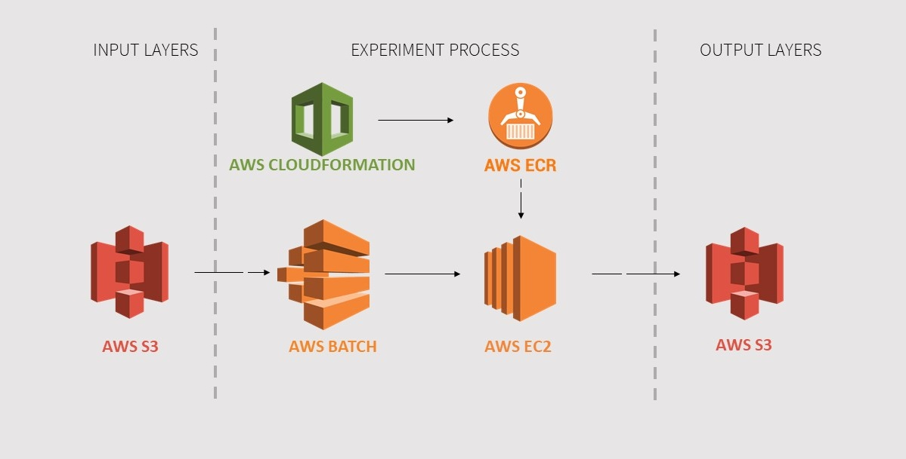
FIGURE 1. AWS SYSTEM ARCHITECTURE

The input layer is an AWS S3 bucket, where the data are hosted.
When the experiment is executed, the AWS Batch Service creates the EC2 instances using the instance types that have been described in the AWS CloudFormation and using the images that are stored inside the AWS ECR. The experiment is being executed inside an AWS EC2 cluster and the results are saved inside a AWS S3 bucket as objects.

# 3. Methodology
## 3.1. Solution Design

The first critical step of every project is a well-designed solution that will be developed in the project. The specifications where described, presented and explained to the DT and ET.

The steps that were described and followed are:
-	Choose three (3) test areas with different characteristics.
-	Find and evaluate data sources for these areas.
-	Develop solution in the cloud.
-	Data Wrangling (digitization, editing, cleaning, preparing for experiment)
-	Execute experiments
-	Evaluate results
-	Repeat

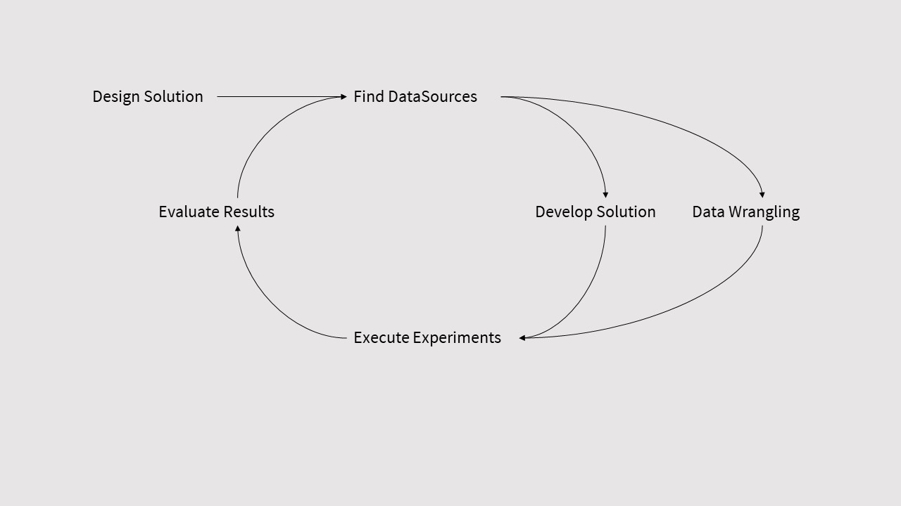
FIGURE 2. WORKFLOW OF DEVELOPING WOODEN-POLES-OBJECT-DETECTION SOLUTION.

# 3.2. Choosing test areas
As it is mention before, they were chosen three (3) test areas from Greece that have different characteristics in their landscape.
1.	Palairos (Aetolia-Acarnania) is a high vegetation and low-class urban area, with flat landscape. The population is more than 2,729 people (2011), with old telecommunication and electricity network distribution.
2.	Tinos (Cyclades) is a low vegetation and low-class urban area, with intense landscape and very new construction activity. The low density of electricity and telecommunication network has been the case in the area.
3.	Koropi (Attica) is low vegetation and high-class urban area, with maximum 5 floor buildings and very new construction activity. The buildings density with combination of electricity & telecommunication network complexity is the case that has been studied here.

## 3.3. Finding data

In this step the DT worked on discovering the required data and evaluated if they’re going to be used inside the experiments.

They were collected:
-	Satellite images from Copernicus Data providers.
-	Satellite images from private satellite vendors.
-	Google Street Maps images.
-	Ktimatologio S.A. WMS ortho-photos.
-	Aerial images, from several other providers.

After that they were evaluated using the resolution, channels, capture year, etc. of each data source and deployed to AWS S3.

## 3.4. Developing solution

T.A. Geoforce using the A.I. experience and knowledge in the most innovating Deep Learning frameworks and technologies. Develop many cases using different procedures and technologies, like:
-	Tensorflow
-	Pytorch
-	FastAI
-	CNTK

In this stage the ET is working very close with DT which create the datasets that are going to be used in the experiment.

## 3.5. Data Wrangling

Definitely, the most time presuming procedure is the data wrangling stage, where the DT was working intense on digitizing poled from the test areas.

After repeating three (3) times this stage we:
-	Carefully studied more than 15km2 area.
-	Digitized more than 3.000 features in these areas.
-	Classify the features as (electrical poles, telecommunication poles, lighting poles, other)

After the digitization there was the phase of editing, by exam each class separately and reclassify if it was necessary.

The cleaning of data is the phase where should be removed data, due the reason of being absolutely garbage, or they are in so good state that can not be imported inside the training procedure.

Finally, preparing the datasets for importing them inside the experiments is a difficult and very high skill process where the DT was working very close with the ET.

## 3.6. Executing experiments

The highest skilled role in an AI project is the role of the Data Scientist, where in that stage the team is working on developing experiments on how the training, validation will be performed. 

Using AWS cloud environment manage to execute more than 100 epochs using EC2:
-	r5.large instances.
-	p2.xlarge (GPU-enabled) instances

The experiments were developed inside Jupyter Notebooks environment. By using this process, the Team can easily reproduce, visualize and share experiments between the members of the teams.

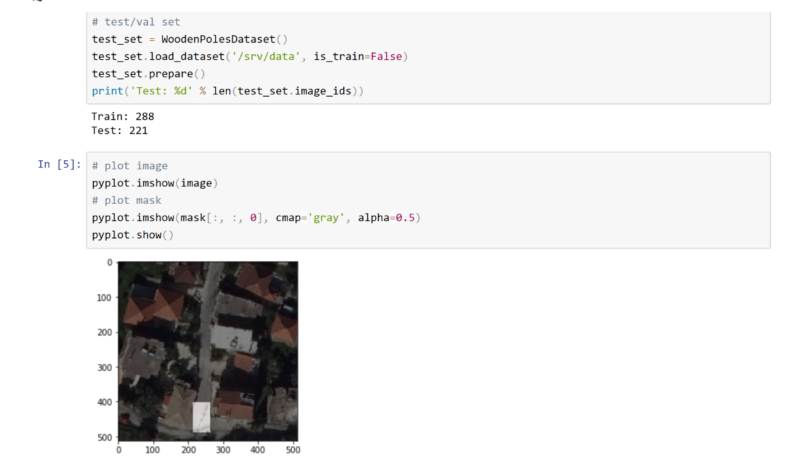
FIGURE 3. EXAMPLE OF AN EXPERIMENT DEVELOPED USING JUPYTER NOTEBOOKS.

The input data were split by the rule of 70-30, which means the 70% of the data are used for training and 30% of the data as validation data.

## 3.7. Evaluating results

The most critical moment in an experiment is the evaluation of the results. In this stage the members of DT and ET are carefully examine the results and try to answer the questions below:
-	Is the model successful?
-	What’s the accuracy of the prediction data?
-	Are we measuring the right things?
-	Are the data that have being imported bias?
-	What have to do, in order to have a better model next time?

Evaluating the results in three (3) phases:
1.	Examine and understand precision & recall[ ], then F1[ ] and compare the results with the ground truth of the validations data.
2.	Visualize the results on the map and check if there are any issues.
3.	Compare the ground truth of the validation dataset with the prediction dataset and the real picture.

Usually, after that stage, we repeat procedure from the start.

# 4. Validation

The first step of the validation process is to be clarify the objectives - real questions that are answering- in the experiments.

The objectives that are examined in the validation are: 
-	Detect spatially poles in the study area using aerial imagery.
-	Distinguish different types of poles (electrical, lighting, telecommunication poles).
-	Evaluate prediction labels with validation labels data.

For that reason, they were created maps that are attached with this document:
1.	[02.eval-print-palairos.pdf](./pdfs/02.eval-print-palairos.pdf) for Palairos area.
2.	[03.eval-print-tinos.pdf](./pdfs/03.eval-print-tinos.pdf) for Tinos area.
3.	[04.eval-print-koropi.pdf](./pdfs/04.eval-print-koropi.pdf) for Koropi area.

Each of these maps it is presented a different model that has being train with different data.

*Attention: The results that have been presented belong to the best-case model (senario) of each study area.*

## 4.1. Results per scene
### 4.1.1. Palairos

For the **Palairos** study area the results are presented in the table below.

TABLE 1. PALAIROS EVALUATION TABLE.
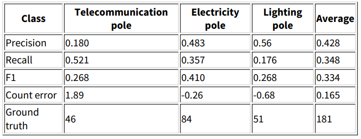
 
For Palairos study area the precision of the telecommunication poles is 0.18. 

But the electricity poles precision is reaching 0.483. With an average value of 0.428.

TABLE 2. PALAIROS LABELS COUNT TABLE.
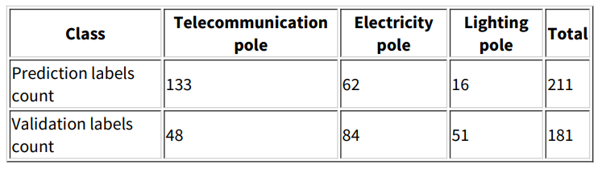

If we combine the precision with the 133 telecommunication poles that were predicted with the validation dataset telecommunication count of 48, we figure out that the model is too high sensitive for telecommunication poles, that’s why there is such low precision value.

Also, if we compare the count of prediction and validation electricity poles and lighting poles, we figure out that the model does not classify correct the pole. This means the learning process can still develop by training with more epochs.
If we examine the results carefully on the map, we will figure out the above:

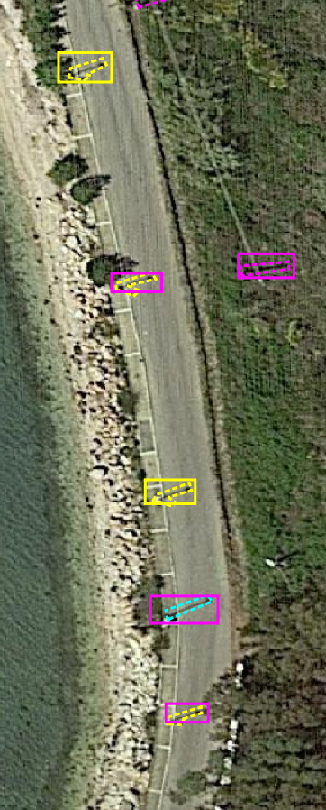

FIGURE 4. PALAIROS STUDY AREA OF MISCLASSIFICATION ISSUE.

The figure above issue with the misclassification of the poles is obvious, where the lighting and electrical poles are classified as telecommunication poles.

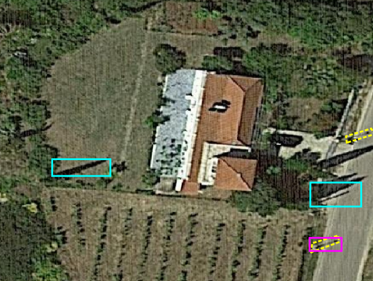

FIGURE 5. MISLEADING FORMS.

In the figure above we examine the case, where linear forms are classified as poles. This issue can be faced using better and more data.

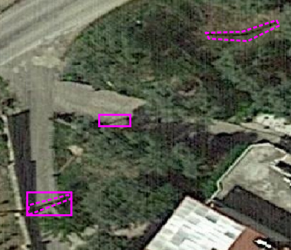

FIGURE 6. LABELS THAT HAS NOT BEING INCLUDED IN THE VALIDATION DATASET AND DETECTED BY THE MODEL.

The figure above, is an example where the model has detected a pole where it is not included in the validation dataset. This means that the real ground truth is different than the one that is described in the validation data.

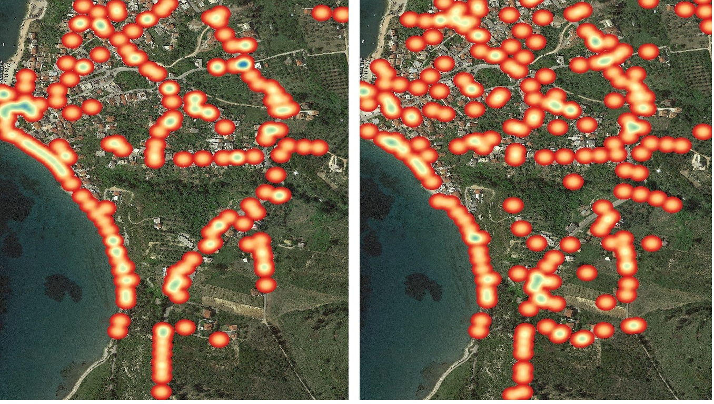
FIGURE 7. DENSITY COMPARISON, LEFT IMAGE VALIDATION HEATMAP, RIGHT PREDICTION HEATMAP

On the figure above we can compare the spatial density of the validation dataset (left), with the spatial density of the prediction dataset (right). As we can understand the predictions are quite close conserving the network development.

### 4.1.2. Tinos

**Tinos** area is a special case, with a lot of differences from the other scenes. The landscape is very different and network (electricity and telecommunication) is not so dense.

TABLE 3. TINOS EVALUATION TABLE.

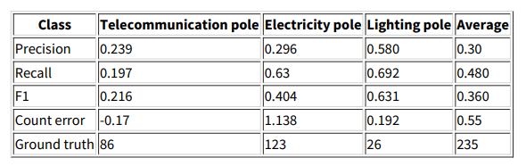

Here we have a precision of 0.25 for telecommunication poles and electricity poles together. The precision average is 0.3.

TABLE 4. TINOS LABELS COUNT TABLE.
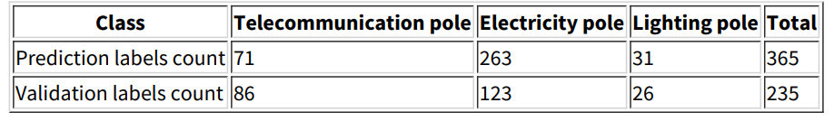

But if we examine the Labels count table (Table 4), we understand that the count of the two datasets for the telecommunication poles is very close (71 -86). This means that the model did a good job on the telecommunication poles classification.

Examine the results on the map, we discover that there are areas where the model did a good job, on the telecommunication poles.
 
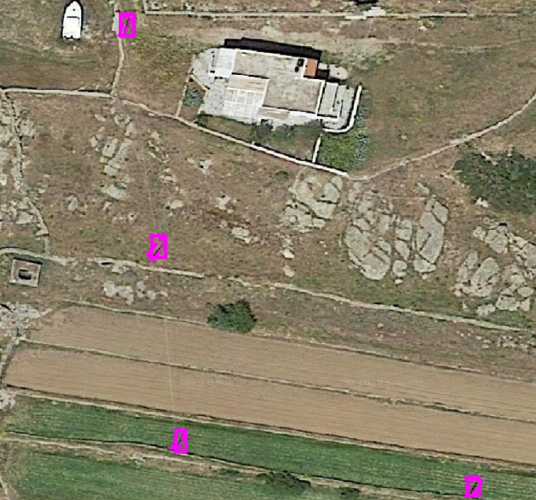
FIGURE 8. TINOS MODEL PERFORMING VERY WELL.

The electricity poles counts have more than 130 electricity poles difference. This is the result of discovering poles that were not included in the validation dataset (Figure 9).

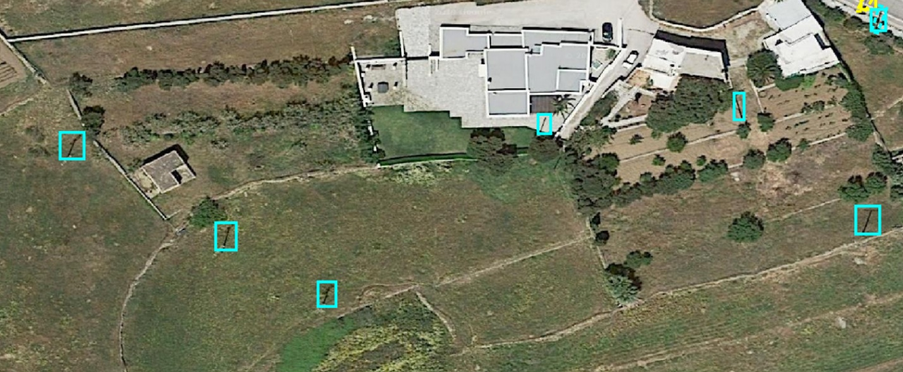
FIGURE 9. POLES THAT WERE DISCOVERED USING THE MODEL.

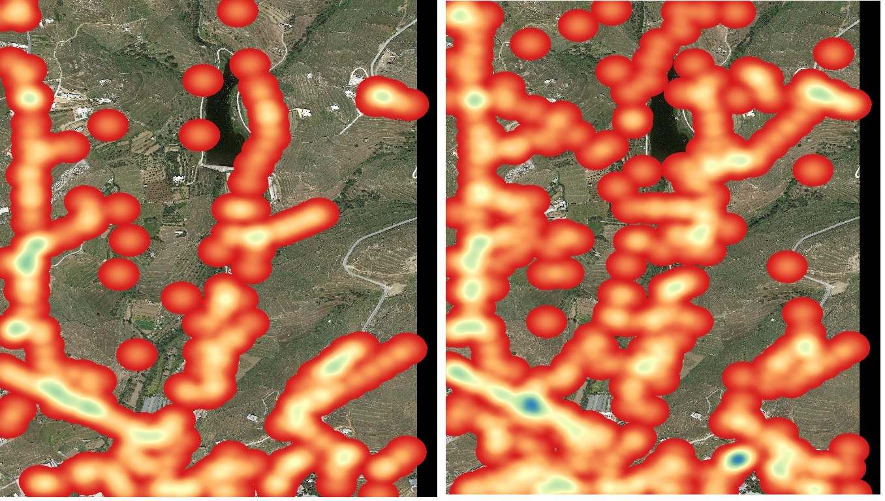
FIGURE 10. DENSITY COMPARISON BETWEEN VALIDATION DATA(LEFT) AND PREDICTION DATA (RIGHT)

In Tinos area the comparison between the density of the validation and prediction data, make us understand the model can predict the pole network development very well and it’s not making predictions randomly.

### 4.1.3. Koropi

**Koropi** area is a very dense area with building constructions. This model had the better prediction performance, with very interesting results.

TABLE 5. KOROPI EVALUATION TABLE.
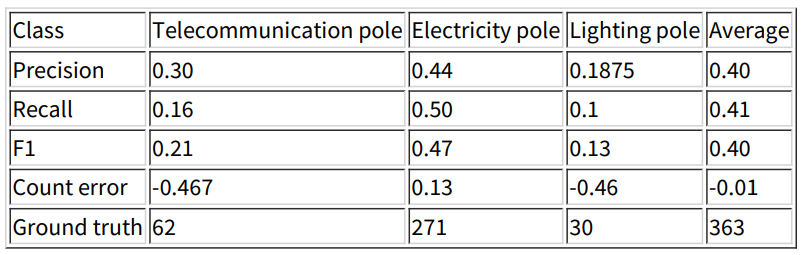

The precision for the telecommunication poles is 0.3 and electricity 0.4. These high values are results of a good training dataset, which in a minimum space where the landscape doesn’t change significantly, the model can perform very well.

TABLE 6. KOROPI LABELS COUNT.
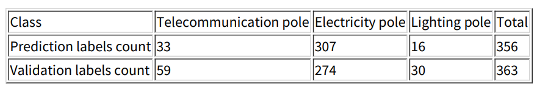

The total labels count is very close between prediction and validation datasets (356-363). That make us enough confident to see better results in the future.
Visualizing the results on the map, we can examine the examples above.

FIGURE 11. MODEL'S GOOD PERFORMANCE

In Figure 11 we can examine a spatially developed of the network across the road, with the model performing at it’s very best.
 
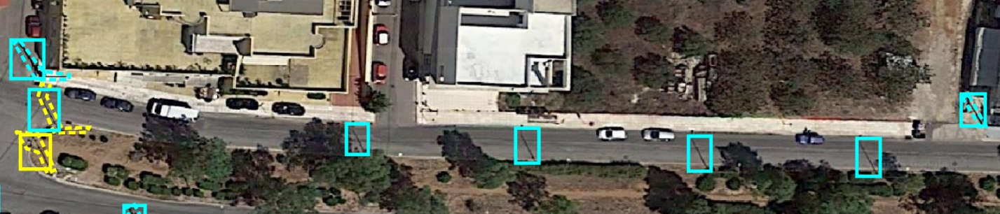
FIGURE 12. MISCLASSIFICATION BETWEEN LIGHTNING AND ELECTRICITY POLES

The issue of misclassification is still present, with the model classifying the poles as electricity.

Koropi area is being also a special case, since our validation data for telecommunication poles were very few. This issue came up by not having the right knowledge of understanding the telecommunication network in such urban areas. For that reason, we decided to classify more poles as electricity poles than telecommunication poles.

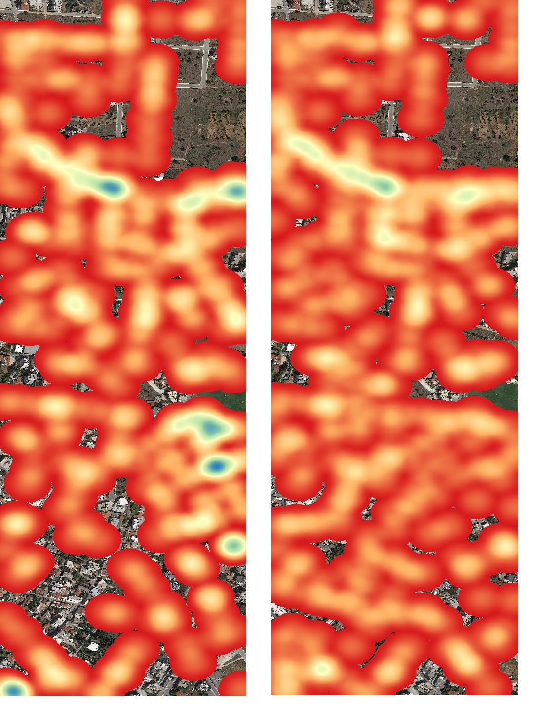
FIGURE 13. DENSITY COMPARISON BETWEEN VALIDATION HEATMAP (LEFT) AND PREDICTION HEATMAP (RIGHT)

In the Figure 13, we can compare the network development in the validation heatmap(left) and the prediction heatmap (right). As we can understand the full development of poles network is present at the prediction heatmap. That means that the model that applied in Koropi area doesn’t predict randomly.

# 5. Conclusions

Wooden-Poles-Object-Detection is a very hard AI project with many aspects of knowledge on analytics to be concerned.

Despite that fact:
1.	The models that have being trained give us a good starting point on what are the difficulties and focus on them. The accuracy of the models can reach over 0.4, that is a good starting point.
2.	The development of the training and validation datasets are very important on training procedure of the models and it is something that is the most cost and time effort task.
3.	But for sure, there is no model, to rule them all. That means that every area in Greece should be evaluated first and applied the right model after.
4.	The logic can do a lot of the dirty work on prevent the model to seek poles in areas that are not possible to be installed and even to give hints for the right classification.
