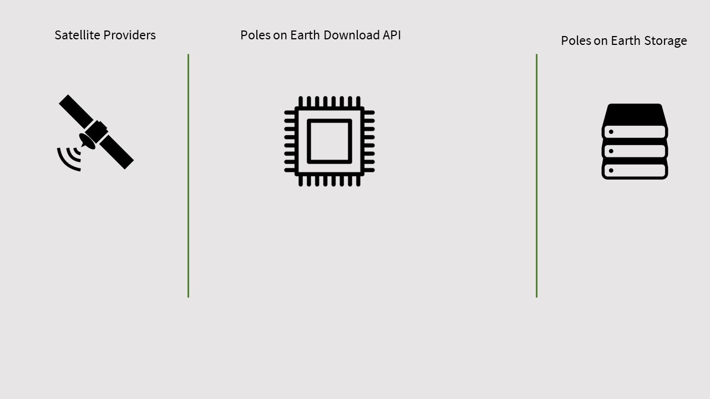
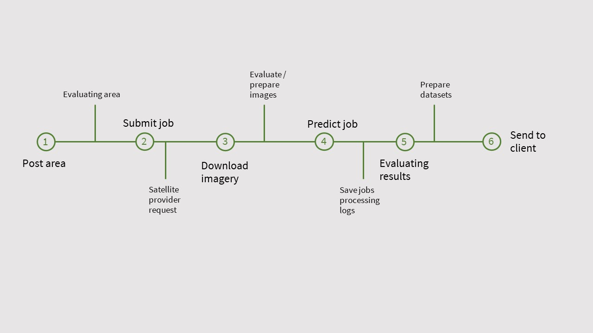
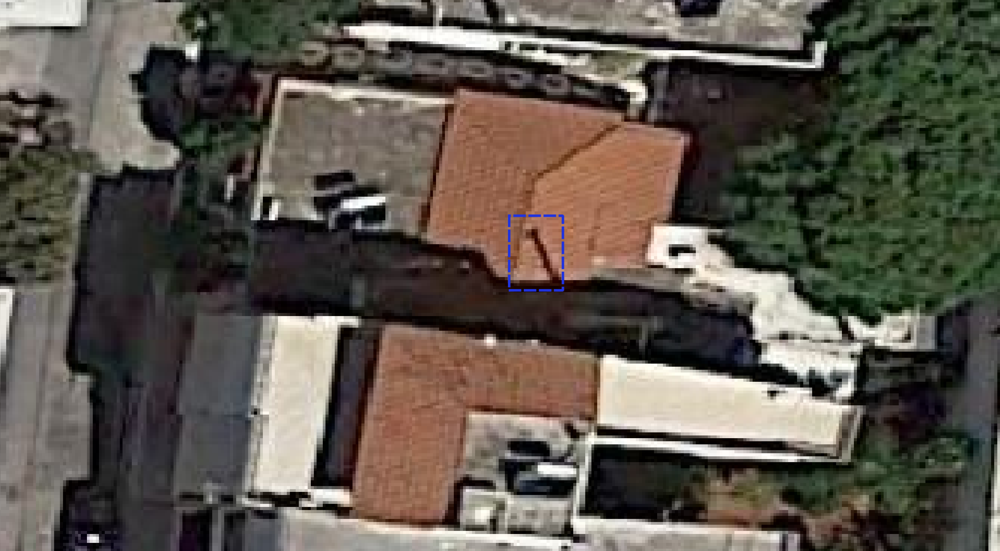
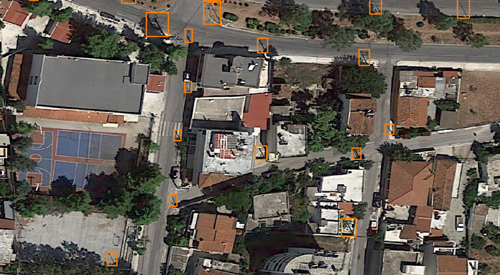
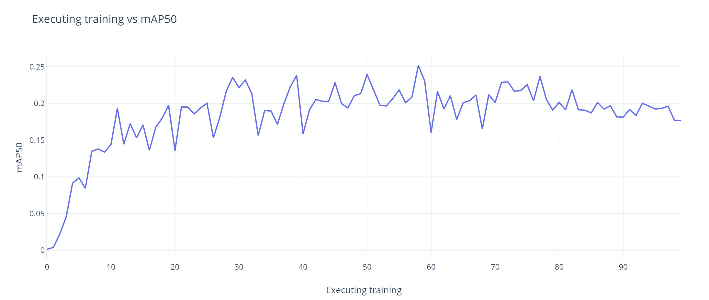

# Poles on Earth 0.12

- [Poles on Earth 0.12](#poles-on-earth-012)
- [License](#license)
- [1. Introduction](#1-introduction)
- [2. Project Structure](#2-project-structure)
- [3. Methodology](#3-methodology)
  - [3.1 Imagery pipeline](#31-imagery-pipeline)
  - [3.1 Executing new case areas](#31-executing-new-case-areas)
- [4. Results](#4-results)
  - [4.1 Models 0.12 performance](#41-models-012-performance)
- [5. Issues](#5-issues)
- [6. Changelog](#6-changelog)
  - [Poles on Earth 0.12](#poles-on-earth-012-1)
  - [Poles on Earth 0.11](#poles-on-earth-011)
  - [Poles on Earth 0.10](#poles-on-earth-010)
- [7. Conclusions](#7-conclusions)

# License

These documents are licensed under the Apache 2 license, quoted below.

Copyright © 2020 T.A. Geoforce [https://tageoforce.com] All rights reserved.

Licensed under the Apache License, Version 2.0 (the "License"); you may not
use this file except in compliance with the License. You may obtain a copy of
the License at

    [http://www.apache.org/licenses/LICENSE-2.0]

Unless required by applicable law or agreed to in writing, software
distributed under the License is distributed on an "AS IS" BASIS, WITHOUT
WARRANTIES OR CONDITIONS OF ANY KIND, either express or implied. See the
License for the specific language governing permissions and limitations under
the License.

Contact: info@tageoforce.com

# 1. Introduction

Utility poles also called power poles or electricity poles, which support wires and electric cables that carry electricity from power companies to end users. These support three facilities including electric power, cable television, and telephone. Material used in the production of utility pole is wood, concrete, composite, and steel, and depending on the use of the material, life span of typical utility pole varies.

*Figure 1. Source [web](https://www.materialsperformance.com/articles/material-selection-design/2019/01/control-of-environmental-degradation-of-concrete-power-poles)*

By Type: 
 - Transmission Poles
 - Distribution Poles
  
By Material:
 - Concrete
 - Wood
 - Steel
 - Composites
  
By Pole Size
 - Below 40ft
 - Between 40 & 70ft
 - Above 70ft

By Use
 - Electricity Transmission & Distribution
 - Telecommunication
 - Street Lighting
 - Heavy Power Lines
 - Subtransmission Lines
 - Others

**Poles on Earth** (https://polesonearth.com) is an AI project, which detects utility poles in global scale from satellite images using Deep Learning techniques.

The problem that **Poles on Earth** is answering is:
 - Detect the current status (or past status) of utility networks.
 - Compares and finds differences with past utility poles detections and discovers events (e.g. natural disasters, war etc.) the effect on the network development.
 - Perform network analytics depending transmission and distribution of electricity and telecommunication development and maintenance.

# 2. Project Structure

**Poles on Earth** (https://polesonearth.com) is separated in three parts:
 - Website (client): Users can select an area by drawing a rectangle and post a *Poles Object Detection* job to the **Poles on Earth** AI services.
 - AI services: API for posting poles detection jobs to **Poles on Earth** infrastructure.
 - Documentation: Open source documents where users can inform about **Poles on Earth** systems, technologies, ideas.

# 3. Methodology

**Poles on Earth** is designed and developed to handle large scale of job requests in a highly demand compute-processing resources. Using cloud scale infrastructure (AWS) and instances with GPU capacity, **Poles on Earth** can scale and increase compute capacity for any kind of ML training procedure.

## 3.1 Imagery pipeline

**Poles on Earth** proceed to contact all the possible satellite imagery provides that can provide:
 - global scale imagery service
 - ultra high resolution images
 - images that can be retrieved from a specific period.

*Figure 2. Poles on Earth imagery download pipeline*

After the selection of multiple satellite imagery providers, **Poles on Earth** developed custom APIs for communicating in-process with other satellite download data APIs.

## 3.1 Executing new case areas

Since the data input of the ML pipeline was resigned, **Poles on Earth** set and new environment for executing ML pipelines that will:
 - increase the performance of the trained models
 - use the new data input pipeline 
 - decrease the training time

Evaluating from previous training procedures and detect bottlenecks into **Poles on Earth** pipelines and we developed the new strategies for fast performing training techniques.

Also, using the download imagery pipeline we increase dramatically the performance of handling large datasets and decrease the waiting time for downloading.

*Chart 3. Poles on Earth pipeline.*

Using our previous train datasets we re-executed all the case areas using other ML models with different parameters. **Poles on Earth** created new evaluation reports and maps.

| Experiment | Scenes | Model | Valid time   | Results |
|------------|--------|-------|--------------|---------|
|     1      |    10   |  0.12 |   6 hours    |   YES   |
|     2      |    15   |  0.12 |   6.7 hours  |   YES   |
|     3      |    20   |  0.12 |   14 hours  |   NO    |

*Table 1. **Poles on Earth** experiments evaluation performance execution pipeline.* 

The `Results` = `NO` means that either was stopped or crashed.

# 4. Results

## 4.1 Models 0.12 performance

| Metric    | Detection poles | 
|-----------|------------------------|
| Precision |        0.63            |
| Recall    |        0.5           |
| F1        |        0.56           |
| Count Error |      -0.21           |
| Ground Truth Count| 3080           |

*Table 2. Detection poles case areas prediction metrics using model 0.12* 

*Figure 3. Model 0.12 (purple) performing better that 0.11 (blue)*

*Figure 4. Model 0.12 performed better on dropping sensitivity*

*Figure 5. Model 0.12 100% accuracy on finding poles*

*Figure 6. Models 0.12 training procedure stable performance*

# 5. Issues

 - Pipeline stability is quite good quality of the images still needs to be tested more.
 - Model's accuracy which still is in urban areas is getting better, urban areas have very good precision. 
 - Uncertainty medium of the current technique.
 - Discover more ways of training data. 

# 6. Changelog

## Poles on Earth 0.12
 - Predictions are experimental
 - Model's average prediction 0.63
 - Download imagery pipeline from satellite providers & evaluation pipeline(RTM)
 - Insights analytics page on staging.

## Poles on Earth 0.11
 - Predictions are experimental
 - Model's average prediction 0.5
 - Download imagery pipeline from satellite providers (RTM)

## Poles on Earth 0.10

 - Predictions are experimental.
 - Initial results of 3 case areas were posted to [Poles on Earth demo](https://polesonearth.com/demo)
 - Model's average prediction 0.4 
 - Payment service on production

# 7. Conclusions

**Poles on Earth** testing ML-pipelines:
  1. Precision is getting higher.
  2. The ML-pipeline is getting more stable.
  3. Satellite download pipeline is tested.  
  4. Insights page will help clients to analyze data.  